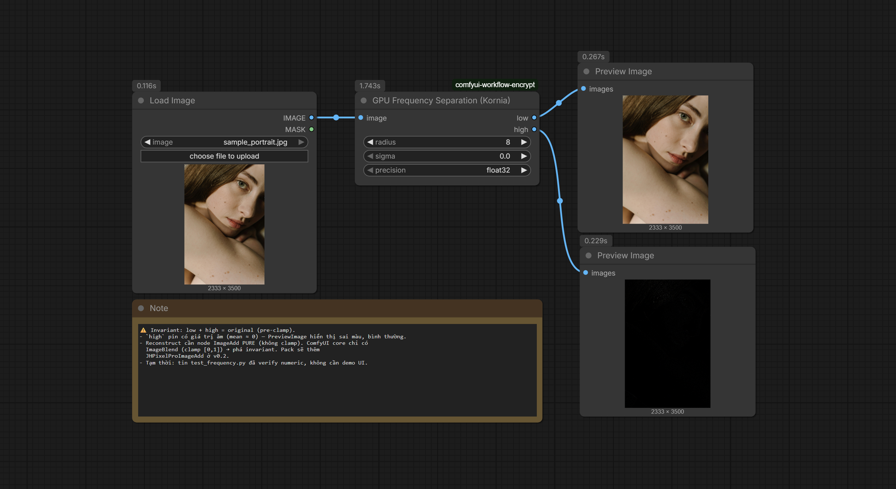
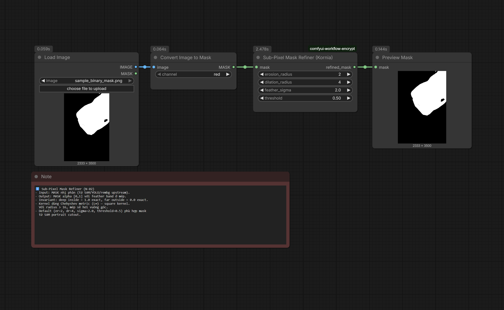
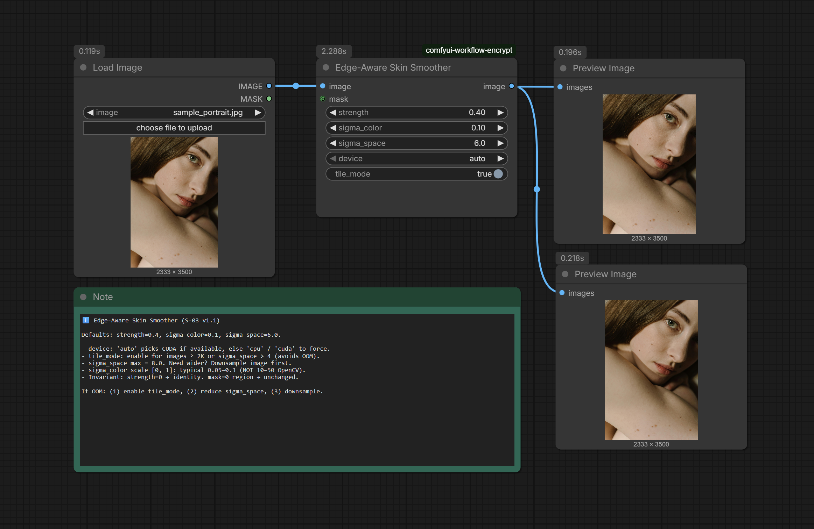
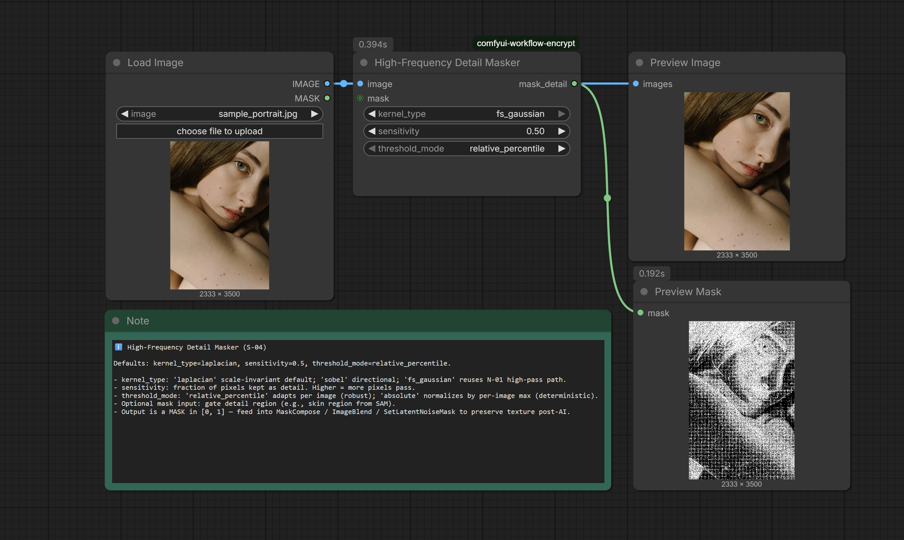
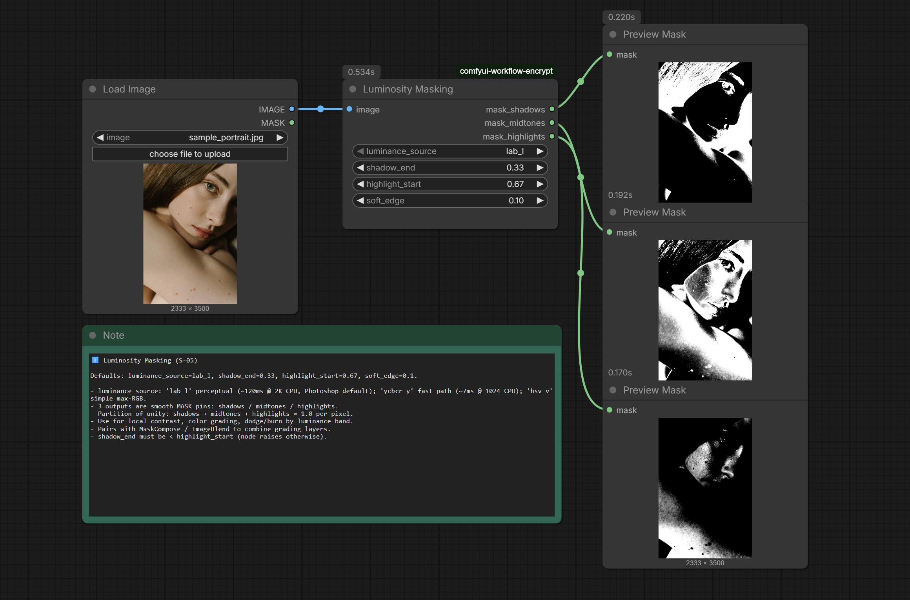
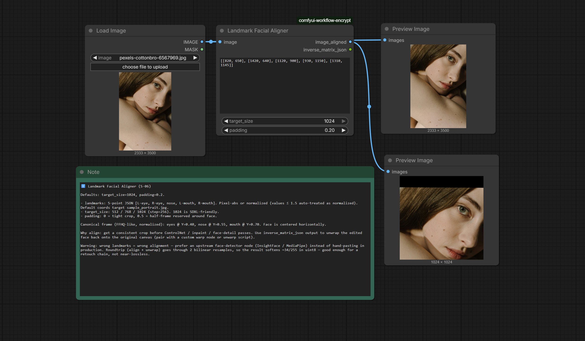
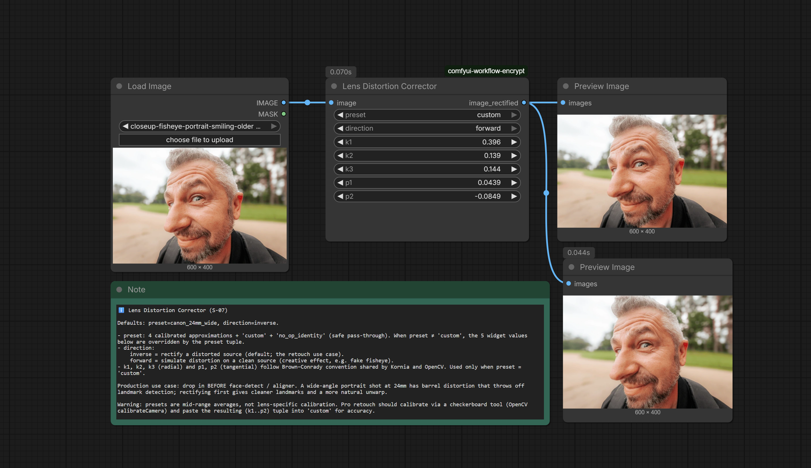
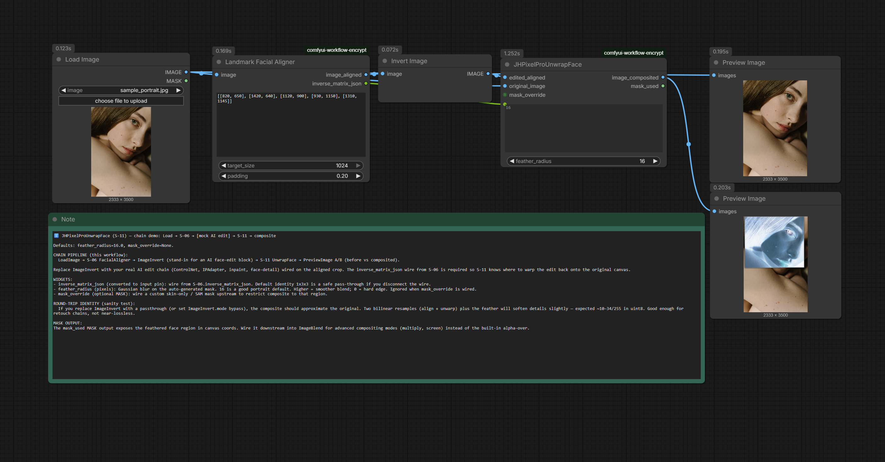

# ComfyUI-JH-PixelPro

> GPU-powered pro-grade image suite for ComfyUI. Kornia at the core. Pure tensor, never leaves VRAM.

**Status:** 🎉 **v0.5.0** (2026-04-19) — 11 nodes live under unified `ComfyUI-JH-PixelPro/*` namespace. Batch-3 color-grade layer ships — `/color` subgroup consolidated (N-05 Luminosity + **N-08** Color Matcher (LAB) + **N-09** Tone Curve (RGB)) via Q-L4 retrofit (UI-only, workflow JSON unaffected). Face pipeline chain `LoadImage → S-07 Lens → S-10 FaceDetect → S-06 Aligner → [AI block] → S-11 Unwrap → Composite` from v0.4.0 remains production-ready. **M3 milestone closed.** See [CHANGELOG](./CHANGELOG.md) for details.

## Why this pack exists

ComfyUI is strong at generative pipelines but lacks the professional retouching operations that work directly on GPU tensors:

- Skin detail loss after VAE / inpaint.
- Hard, chipped mask edges (halo) from SAM / YOLO.
- Skin tone drift after image generation.

This pack packages 9 Kornia-powered nodes for Phases 1–3, then expands into other CV tasks (segmentation, tracking, 3D, color science).

## Scope

| Phase | Node group | Coverage |
|---|---|---|
| 1 | filters + morphology | Frequency separation, mask refiner, edge-aware smoother, detail masker, luminosity masking |
| 2 | geometry | Facial aligner, lens distortion corrector |
| 3 | color | RAW-space color matcher, tone curve & color balance |
| after v1.0 | *(TBD)* | Segmentation, tracking, depth, advanced color |

## Install

Copy or clone this folder into `ComfyUI/custom_nodes/`:

```bash
cd ComfyUI/custom_nodes
git clone https://github.com/jetthuangai/ComfyUI-JH-PixelPro.git
cd ComfyUI-JH-PixelPro
pip install -r requirements.txt
```

Restart ComfyUI. The nodes appear under the `image/pixelpro/<group>` menu.

## Requirements

- ComfyUI ≥ 0.43.x
- Python ≥ 3.10
- PyTorch (installed alongside ComfyUI)
- Kornia ≥ 0.7.0
- NVIDIA GPU with ≥ 8 GB VRAM (primary target); **CPU fallback is supported** (correctness only — no speed guarantee).

## Node list *(updated per Phase progress)*

- [x] N-01 GPU Frequency Separation
- [x] N-02 Sub-Pixel Mask Refiner
- [x] N-03 Edge-Aware Skin Smoother
- [x] N-04 High-Frequency Detail Masker
- [x] N-05 Luminosity Masking
- [x] N-06 Landmark Facial Aligner
- [ ] N-07 Lens Distortion Corrector
- [ ] N-08 RAW-Space Color Matcher
- [ ] N-09 GPU Tone Curve & Color Balance

## Engineering principles

1. **Pure tensor in, pure tensor out** — no file I/O, no PIL, no NumPy in the core math.
2. **Invariant tests as primary acceptance** — not just "output looks right".
3. **Device awareness** — automatic `cpu` and `cuda:N`, never hard-coded.
4. **BCHW channel convention** inside the core; convert at the ComfyUI integration boundary.
5. **No silent exceptions.**

## N-01 GPU Frequency Separation

Splits an image into two layers: `low` (Gaussian blur — color + soft form) and `high` (high-frequency detail — texture, edges, pores). This is the industry-standard retouch technique: smooth skin on `low` without destroying texture on `high`. Math invariant: `low + high = original` (pre-clamp), lossless reconstruction with `precision=float32`.

**Inputs:**

| Name | Type | Default | Description |
|---|---|---|---|
| `image` | IMAGE | — | ComfyUI IMAGE tensor (BHWC, float32 `[0, 1]`). |
| `radius` | INT | `8` | Gaussian blur radius in pixels. Range 1..128. |
| `sigma` | FLOAT | `0.0` | Sigma override. `0.0` = auto `radius/2` (Photoshop convention). |
| `precision` | COMBO | `float32` | `float32` = lossless reconstruction (atol 1e-5). `float16` = ~2× faster on GPU, reconstruction error ~1e-3. |

**Outputs:**

| Name | Type | Description |
|---|---|---|
| `low` | IMAGE | Low-frequency layer. Range `[0, 1]`. |
| `high` | IMAGE | High-frequency layer. **⚠️ May contain negative values** (mean ≈ 0). `PreviewImage` will display miscoloured output — this is expected, not a bug. A pure (non-clamping) `ImageAdd` node is required to reconstruct. |

**Sample workflow:** [workflows/S-01-frequency-separation.json](workflows/S-01-frequency-separation.json)

**Run the sample:** copy `workflows/sample_portrait.jpg` → `ComfyUI/input/sample_portrait.jpg`, then Load the workflow and press Queue Prompt. The sample image is [Photo by cottonbro studio on Pexels](https://www.pexels.com/photo/close-up-photo-of-woman-s-beautiful-face-6567969/) (redistribution free under the Pexels Content License).



### Limitations

- **The reconstruct branch is not included in v0.1.** ComfyUI core ships only `ImageBlend`, which clamps to `[0, 1]` and breaks the invariant when `high` contains negative values. Use an external `ImageAdd` pack, or wait for `JHPixelProImageAdd` in v0.2.
- See the Note node inside [workflows/S-01-frequency-separation.json](workflows/S-01-frequency-separation.json) for a detailed invariant explanation.
- `precision=float16` is recommended on GPU only; on CPU it will warn (slower than float32).

## N-02 Sub-Pixel Mask Refiner

Feathers a binary MASK (from SAM / YOLO / rembg upstream) into a sub-pixel alpha mask: "definitely inside" pixels pin to `1.0`, "definitely outside" pixels pin to `0.0`, and the uncertain band near the edge is Gaussian-feathered. Used for cutout, compositing, and alpha matting in professional retouch pipelines.

**Inputs:**

| Name | Type | Default | Description |
|---|---|---|---|
| `mask` | MASK | — | ComfyUI MASK tensor (BHW float32 `[0, 1]`). Binary-ish — midtones are allowed but will be thresholded before morphology. |
| `erosion_radius` | INT | `2` | Pixel radius of the "definitely inside" core. Range 0..64. `0` = no inside protection. |
| `dilation_radius` | INT | `4` | Pixel radius of the "definitely outside" core. Set ≥ `erosion_radius` for a stable feather band. Range 0..64. |
| `feather_sigma` | FLOAT | `2.0` | Gaussian sigma (pixels) used to feather the uncertain band. Range 0.1..32.0 (step 0.1). |
| `threshold` | FLOAT | `0.5` | Strict binarization threshold (`mask > threshold`) applied before morphology. Range 0.0..1.0 (step 0.01). |

**Outputs:**

| Name | Type | Description |
|---|---|---|
| `refined_mask` | MASK | Sub-pixel alpha mask. Range `[0, 1]`. Inside core = `1.0` exact, outside core = `0.0` exact, feather band in between. |

**Sample workflow:** [workflows/S-02-subpixel-mask-refiner.json](workflows/S-02-subpixel-mask-refiner.json)

**Run the sample:** copy `workflows/sample_binary_mask.png` → `ComfyUI/input/sample_binary_mask.png`, then Load the workflow and press Queue Prompt.



### Limitations

- **Square kernel (Chebyshev / L∞ metric).** Erosion and dilation use a square kernel, not a Euclidean disk — with `radius > 16`, mask edges look slightly boxy rather than rounded. Disk-kernel option deferred to v0.2.
- **v1 is float32 only.** Unlike N-01, the mask refiner does not expose a `precision` pin — `feather_sigma > 0` requires enough floating-point precision for the Gaussian. Float16 deferred to v0.2 once lessons from N-01 settle.
- See the Note node inside [workflows/S-02-subpixel-mask-refiner.json](workflows/S-02-subpixel-mask-refiner.json) for the full invariant description plus the `er=dr=0` edge case.

## N-03 Edge-Aware Skin Smoother

Edge-preserving bilateral smoothing for portrait skin retouch. Smooths flat regions (cheeks, forehead) while preserving sharp edges (eyes, lips, hair). Typical pro dose is 30–50% (`strength=0.4`). An optional `mask` input gates smoothing to a specific region — connect the N-02 refined mask upstream to smooth skin only, leaving eyes and hair untouched.

**Inputs:**

| Name | Type | Default | Description |
|---|---|---|---|
| `image` | IMAGE | — | ComfyUI IMAGE tensor (BHWC, float32 `[0, 1]`). RGB only. |
| `strength` | FLOAT | `0.4` | Blend between smoothed and original. `0.0` = identity (bypass), `1.0` = full smoothing. Typical pro dose 0.3–0.5. Range 0.0..1.0 (step 0.01). |
| `sigma_color` | FLOAT | `0.1` | Intensity sigma on the `[0, 1]` image scale — **not** the 8-bit 10–50 range from OpenCV docs. Small values preserve edges; large values smooth across weak edges. Range 0.01..0.5 (step 0.01). |
| `sigma_space` | FLOAT | `6.0` | Spatial sigma in pixels. Larger = wider spatial influence = stronger smoothing. Kernel size auto-sized to `2*ceil(3*sigma_space)+1`. Range 1.0..8.0 (v1.1 cap). For wider smoothing, downsample the image first with an upstream Resize node. |
| `device` | COMBO | `auto` | Compute device. `auto` picks CUDA if available, else CPU. Explicit `cuda` raises if CUDA is unavailable. `cpu` forces CPU (slow but deterministic). |
| `tile_mode` | BOOLEAN | `False` | Enable 512×512 tile processing to avoid OOM on large images. Required for 4K+ or `sigma_space > 4` on most GPUs. Leave off for small images (≤1K) for max speed. |
| `mask` | MASK | *(optional)* | Optional region gate (BHW float32 `[0, 1]`). Where `mask=0` the output equals the input pixel-exact; where `mask=1` full smoothing applies; intermediate values blend. |

**Outputs:**

| Name | Type | Description |
|---|---|---|
| `image` | IMAGE | Smoothed image. Range `[0, 1]`. Same shape and dtype as the input. |

**Sample workflow:** [workflows/S-03-edge-aware-smoother.json](workflows/S-03-edge-aware-smoother.json)

**Run the sample:** copy `workflows/sample_portrait.jpg` → `ComfyUI/input/sample_portrait.jpg`, then Load the workflow and press Queue Prompt. The two PreviewImage nodes render the original and the smoothed result side by side.



### Performance & device options (v1.1)

- **`device` pin.** `auto` picks CUDA if a GPU is present, otherwise CPU. Use `cuda` to fail loudly if a GPU is required (raises `RuntimeError` if CUDA is unavailable). Use `cpu` to pin the run to CPU regardless of hardware.
- **`tile_mode` pin.** Off by default. Enable it for 4K+ images or any run with `sigma_space > 4` — the kernel is processed in 512×512 tiles and stitched, trading a small speed hit for an OOM-proof path. Leave it off for images ≤1K for max throughput.
- **`sigma_space` cap = 8.0.** Wider smoothing is deliberately blocked: it blows up the kernel and the memory budget. To smooth wider, downsample the image first (Resize node upstream), run the smoother, and upscale back.
- **2 GB memory guardrail.** A non-tile run whose projected peak memory exceeds ≈2 GB raises a `RuntimeError` early with an actionable message (`enable tile_mode`, `reduce sigma_space`, or `downsample`), instead of crashing with CUDA OOM halfway through.

### Limitations

- **`sigma_color` is on the `[0, 1]` image scale.** OpenCV's `cv2.bilateralFilter` uses 8-bit sigmas in the 10–50 range; they do not port over. Start around `0.05–0.3` for natural skin retouch.
- **CPU path is correctness-only above 1K.** On CPU a `1×3×1024×1024` run takes tens of seconds. For production-sized images prefer GPU, and enable `tile_mode` for anything ≥2K. The memory guardrail will surface the problem early if you forget.
- **Guided-filter mode and float16 are deferred to v2.** The v1 kernel is bilateral-only and float32-only.

## N-04 High-Frequency Detail Masker

Generate a binary detail-preservation mask from high-frequency energy in the image. Feeds downstream `ImageBlend` / `MaskCompose` / `SetLatentNoiseMask` nodes so AI passes (inpaint, upscale, style-transfer) can keep the hair, eyebrows, fabric weave and pore texture intact while the rest of the face is freely repainted. Three high-pass operators are selectable and the threshold is either adaptive (per-image percentile) or deterministic (per-image max-normalized).

**Inputs:**

| Name | Type | Default | Description |
|---|---|---|---|
| `image` | IMAGE | — | ComfyUI IMAGE tensor (BHWC, float32 `[0, 1]`). RGB only. |
| `kernel_type` | COMBO | `laplacian` | High-pass operator. `laplacian` is scale-invariant and isotropic (default). `sobel` is directional (emphasizes edges). `fs_gaussian` reuses the N-01 high-pass path. |
| `sensitivity` | FLOAT | `0.5` | Fraction of pixels kept as detail. Higher = more pixels pass. `0.0` → empty mask, `1.0` → full mask. Range 0.0..1.0 (step 0.01). |
| `threshold_mode` | COMBO | `relative_percentile` | `relative_percentile` adapts per image (robust cross-image). `absolute` normalizes by per-image max (deterministic but more sensitive to outliers). |
| `mask` | MASK | *(optional)* | Pre-gate region (BHW float32 `[0, 1]`). Output detail is zeroed where this mask is 0 — useful for restricting detail to the skin region returned by SAM / rembg. |

**Outputs:**

| Name | Type | Description |
|---|---|---|
| `mask_detail` | MASK | Binary detail mask, BHW float32 `[0, 1]`. |

**Sample workflow:** [workflows/S-04-hf-detail-masker.json](workflows/S-04-hf-detail-masker.json)

**Run the sample:** copy `workflows/sample_portrait.jpg` → `ComfyUI/input/sample_portrait.jpg`, then Load the workflow and press Queue Prompt.



### Use cases

- **Post-AI texture protection.** Compose the detail mask into a `SetLatentNoiseMask` so denoise keeps the high-frequency regions unchanged.
- **Hair/eyelash preservation** during inpaint — blend original hair back on top of the inpainted face using the detail mask as alpha.

### Limitations

- **Output is a MASK, not an IMAGE.** Pipe through `MaskCompose`, `ImageBlend` or `SetLatentNoiseMask` to apply it — there is no built-in visualization beyond `MaskPreview`.
- **`sensitivity` is fraction-of-pixels, not a hard luma threshold.** Two images with different noise floors will give different absolute thresholds even at the same `sensitivity` — that is the point of `relative_percentile`.

## N-05 Luminosity Masking

Split an image into three smooth luminosity masks (shadows / midtones / highlights), Photoshop-style, with a partition-of-unity guarantee (`shadows + midtones + highlights ≈ 1.0` per pixel). Use each band as an alpha mask to target local contrast, color grading, dodge/burn or AI denoise only in the bright or dark regions — selection by luminance band, not by shape.

**Inputs:**

| Name | Type | Default | Description |
|---|---|---|---|
| `image` | IMAGE | — | ComfyUI IMAGE tensor (BHWC, float32 `[0, 1]`). RGB only. |
| `luminance_source` | COMBO | `lab_l` | Luminance channel. `lab_l` is perceptual (Photoshop default, ~120 ms @ 2K CPU). `ycbcr_y` is the fast path (~7 ms @ 1024 CPU) — use it for realtime preview or CPU-bound pipelines. `hsv_v` is simple max-RGB and less perceptual. |
| `shadow_end` | FLOAT | `0.33` | Upper bound of the shadow band (luminance `[0, 0.5]`). |
| `highlight_start` | FLOAT | `0.67` | Lower bound of the highlight band (luminance `[0.5, 1.0]`). Must be > `shadow_end` (node raises otherwise). |
| `soft_edge` | FLOAT | `0.1` | Smoothstep transition width at both band edges. Smaller = sharper bands, larger = smoother blend. Range 0.01..0.3 (step 0.01). |

**Outputs:**

| Name | Type | Description |
|---|---|---|
| `mask_shadows` | MASK | Shadow band mask, BHW float32 `[0, 1]`. |
| `mask_midtones` | MASK | Midtone band mask, BHW float32 `[0, 1]`. |
| `mask_highlights` | MASK | Highlight band mask, BHW float32 `[0, 1]`. |

**Sample workflow:** [workflows/S-05-luminosity-masking.json](workflows/S-05-luminosity-masking.json)

**Run the sample:** copy `workflows/sample_portrait.jpg` → `ComfyUI/input/sample_portrait.jpg`, then Load the workflow and press Queue Prompt. Three `MaskPreview` nodes render the shadow, midtone and highlight masks separately.



### Use cases

- **Luminosity grading.** Multiply a color LUT only through `mask_midtones` to split-tone without touching shadows and highlights.
- **Band-limited denoise** — restrict denoise to `mask_shadows` so shadow noise is cleaned without softening highlight detail.
- **Local dodge/burn** — apply exposure lift through `mask_shadows` and crush through `mask_highlights`.

### Limitations

- **Performance tradeoff on CPU.** `lab_l` is perceptual but costs ~120 ms @ 2K CPU vs ~7 ms @ 1024 CPU for `ycbcr_y`. Switch to `ycbcr_y` when driving a realtime preview on CPU; stay on `lab_l` for final renders.
- **Partition is approximate near band edges.** With small `soft_edge` (< 0.03) the normalize step cannot preserve exact unity at transition pixels — the sum is rescaled to 1.0, so you will see a ~`soft_edge`-wide blend zone.

## N-06 Landmark Facial Aligner

Align a face to a canonical FFHQ-like frame via 5 landmarks using a similarity transform (rotation + uniform scale + translation — no shear), and return both the aligned image and the inverse transform so you can unwrap the result back onto the original canvas. This is the canonical pre-processing step in front of ControlNet, face-detail and inpaint passes — it gives every output a consistent eye / nose / mouth position so batch operations stay stable.

**Inputs:**

| Name | Type | Default | Description |
|---|---|---|---|
| `image` | IMAGE | — | ComfyUI IMAGE tensor (BHWC, float32 `[0, 1]`). RGB only. |
| `landmarks` | STRING | *(5-point JSON)* | 5-point landmark JSON in order `[L-eye, R-eye, nose, L-mouth, R-mouth]`. Pixel-absolute or normalized — values ≤ 1.5 are auto-treated as normalized. Shape `5x2` for single image or `Bx5x2` for batch. |
| `target_size` | INT | `1024` | Square output size in pixels. Accepts `512 / 768 / 1024` (step 256). `1024` is SDXL-friendly. |
| `padding` | FLOAT | `0.2` | Ratio of canonical frame reserved around the face (hair/chin room). `0.0` = tight crop, `0.5` = half-frame padding. |

**Outputs:**

| Name | Type | Description |
|---|---|---|
| `image_aligned` | IMAGE | Aligned face image at `target_size × target_size`. Range `[0, 1]`. |
| `inverse_matrix_json` | STRING | JSON-serialized `B × 3 × 3` inverse affine matrix (list of 3×3 per batch item). Use it to unwrap the edited aligned face back onto the original canvas. |

**Canonical frame (FFHQ-like).** In normalized coordinates: eyes at `Y=0.40`, nose at `Y=0.55`, mouth at `Y=0.70`, face centered horizontally. Pulled in by `padding` (default `0.2`).

**Sample workflow:** [workflows/S-06-facial-aligner.json](workflows/S-06-facial-aligner.json)

**Run the sample:** copy `workflows/sample_portrait.jpg` → `ComfyUI/input/sample_portrait.jpg`, then Load the workflow and press Queue Prompt. Two `PreviewImage` nodes render the original and the aligned result.



### Use cases

- **Consistent ControlNet / inpaint pipeline.** Align → run `ControlNet` / `KSampler` → unwrap via `inverse_matrix_json` so the edited face lands back in the original composition.
- **Batch portrait grading** — everyone gets the same eye/mouth position before global filters are applied.

### Limitations

- **Manual landmarks are a stop-gap.** In production, feed landmarks from an upstream face detector (InsightFace, MediaPipe). Wrong landmarks = wrong alignment — this node does not sanity-check face geometry beyond the 5×2 shape.
- **Roundtrip bilinear smoothing.** Align + unwrap puts the image through two bilinear resamples, which softens the result by ~34/255 in uint8. Good enough for a retouch chain, not near-lossless — do not chain more than one round.
- **Mediapipe dependency for landmark detection is optional.** The core ships a fallback 5-point JSON so the pack loads without `mediapipe` installed. For automatic landmark detection, pair with a separate face-detect custom node upstream.

## N-07 Lens Distortion Corrector

Apply Brown–Conrady radial + tangential distortion correction (`inverse`) or simulation (`forward`) to a ComfyUI IMAGE. Drop in **before** face-detect or alignment to rectify wide-angle portrait shots — barrel distortion at 24mm pulls corners inward and throws off landmark detection. Ships with four calibrated presets so you don't have to hand-tune coefficients for the common cases.

**Inputs:**

| Name | Type | Default | Description |
|---|---|---|---|
| `image` | IMAGE | — | ComfyUI IMAGE tensor (BHWC, float32 `[0, 1]`). RGB only. |
| `preset` | COMBO | `no_op_identity` | One of `canon_24mm_wide`, `sony_85mm_tele`, `gopro_fisheye`, `no_op_identity`, `custom`. When `≠ custom`, the 5 widget values below are overridden by the preset tuple. |
| `direction` | COMBO | `inverse` | `inverse` = rectify a distorted source (default; the retouch use case). `forward` = simulate distortion on a clean source (creative effect). |
| `k1` | FLOAT | `0.0` | Radial coefficient k1, range `[-1.0, 1.0]`, step `0.001`. Used only when `preset = custom`. |
| `k2` | FLOAT | `0.0` | Radial coefficient k2, same range. |
| `k3` | FLOAT | `0.0` | Radial coefficient k3, same range. |
| `p1` | FLOAT | `0.0` | Tangential coefficient p1, range `[-0.1, 0.1]`, step `0.0001`. |
| `p2` | FLOAT | `0.0` | Tangential coefficient p2, same range. |

**Outputs:**

| Name | Type | Description |
|---|---|---|
| `image_rectified` | IMAGE | Distortion-corrected (or simulated) IMAGE at the same shape as input. Range `[0, 1]`. |

**Preset coefficients** (mid-range approximations, tested on 35mm-equivalent crop):

| Preset | k1 | k2 | k3 | p1 | p2 |
|---|---|---|---|---|---|
| `canon_24mm_wide` | -0.18 | 0.08 | -0.02 | 0.0 | 0.0 |
| `sony_85mm_tele` | 0.03 | -0.01 | 0.0 | 0.0 | 0.0 |
| `gopro_fisheye` | -0.35 | 0.12 | -0.04 | 0.0 | 0.0 |
| `no_op_identity` | 0.0 | 0.0 | 0.0 | 0.0 | 0.0 |

**Sample workflow:** [workflows/S-07-lens-distortion.json](workflows/S-07-lens-distortion.json)



### Use cases

- **Pre-process before face pipeline.** Rectify a wide-angle portrait → run S-10 FaceDetect → S-06 FacialAligner → cleaner landmarks, more natural unwarp.
- **Creative fake-fisheye.** `direction = forward` + `gopro_fisheye` preset on a flat 50mm shot for a lens-distorted look.

### Limitations

- **Presets are approximations, not lens-specific calibration.** For pro retouch, calibrate the actual lens via OpenCV `calibrateCamera` (checkerboard) and paste the resulting `(k1..p2)` tuple into the `custom` preset for accurate correction.
- **CPU path uses `cv2.remap` for `inverse`.** GPU path uses Kornia `undistort_image` and falls back to cv2 if Kornia raises. The forward path always uses Kornia `undistort_points` + `grid_sample`.

## N-08 Color Matcher (LAB)

Reinhard LAB color transfer for ComfyUI IMAGE tensors. Match the chroma of a target image (typically the output of an AI pass — SDXL face refine, IPAdapter, inpaint) to a reference image (the pre-AI source) so the AI result keeps the original's skin tone, white balance, and color cast. Operates in LAB space so you can choose between matching chroma only (`ab`, preserves the AI output's lighting) or full tone (`lab`).

**Inputs:**

| Name | Type | Default | Description |
|---|---|---|---|
| `image_target` | IMAGE | — | The image to be corrected — typically the AI output that drifted in color (BHWC, float32 `[0, 1]`). |
| `image_reference` | IMAGE | — | The image whose color statistics will be transferred — typically the pre-AI source. **Must have the same H × W as `image_target`** (batch can be 1 or match target). |
| `channels` | COMBO | `ab` | `ab` = match chroma only, preserve target luminance (pro retouch default — avoids washing out the AI output's lighting). `lab` = match L + a + b (full tone transfer including brightness). |
| `strength` | FLOAT | `1.0` | Blend factor `[0, 1]`, step `0.01`. `0` = identity target (bypass), `1` = full match. Typical pro dose `0.6–0.8` for natural skin-tone correction. |

**Optional inputs:**

| Name | Type | Description |
|---|---|---|
| `mask` | MASK | Optional MASK (BHW float32 `[0, 1]`) restricting **statistics computation** to the masked region — useful when you only want to match skin tone, not the background. The output is always applied to the full target; the mask only gates which pixels are used to estimate the mean / std transfer. Each batch item must contain at least one positive pixel. |

**Outputs:**

| Name | Type | Description |
|---|---|---|
| `image_matched` | IMAGE | The target image with its chroma (and optionally luminance) re-anchored to the reference. Same shape as `image_target`. Range `[0, 1]`. |

**Sample workflow:** [workflows/S-08-color-matcher.json](workflows/S-08-color-matcher.json)

### Use cases

- **AI output color drift fix.** Pass the SDXL / IPAdapter / inpaint result as `image_target` and the pre-AI source as `image_reference` — restores the original skin tone without touching the AI's facial detail.
- **Skin-tone consistency across a batch.** Pick one anchor portrait as the reference, run every other portrait through `channels=ab` strength `0.7` for a unified look.
- **Product photography color matching.** Match a re-shot product against a brand-approved reference for consistent catalog color.

### Caveats

- **Reference must match target H × W.** No automatic resize — pre-resize the reference upstream with `ImageScale` if needed.
- **`mask` is a stat-gate, not an output mask.** It restricts which pixels feed the Reinhard mean/std estimation. The output composite is always applied to the full target. For region-restricted output, multiply downstream with the same mask via `ImageBlend`.
- **Reinhard transfer assumes both target and reference share a similar tonal regime.** A daylight portrait matched against a tungsten reference will look unnatural — pre-grade closer first, then use small `strength` to fine-tune.

### Performance

CPU 2K benchmark misses the aspirational `< 100 ms` bound on a CPU-only runner: `ab` mode `~549 ms`, `lab` mode `~456 ms`. Root cause is the Kornia `rgb_to_lab` / `lab_to_rgb` round-trip alone — about `~254 ms` at 2K — which is the library throughput ceiling, not the masked-stat math itself. CPU 1K modes pass the bound (`ab ~111 ms` / `lab ~82 ms`). The GPU path is **not evaluated** on this CPU-only runner; LAB conversion + masked stats are likely fast on CUDA. For 2K pro retouch, recommend running on GPU or the downsample → match → upsample pattern. See [`R-20260419-bench-S-08.md`](../../.agent-hub/50_reports/R-20260419-bench-S-08.md) for full numbers.

## N-09 Tone Curve (RGB)

Photoshop-style 8-control-point tone curve baked into a 1024-step Catmull-Rom LUT and applied to a ComfyUI IMAGE. Five hand-tuned presets cover the common contrast / lift / crush moves; the `custom` preset takes an 8-point JSON for arbitrary curves. Apply globally (`rgb_master`) for contrast, or to a single channel (`r` / `g` / `b`) for white-balance / color-balance correction.

**Inputs:**

| Name | Type | Default | Description |
|---|---|---|---|
| `image` | IMAGE | — | ComfyUI IMAGE tensor (BHWC, float32 `[0, 1]`). RGB only. |
| `preset` | COMBO | `linear` | One of `linear` / `s_curve_mild` / `s_curve_strong` / `lift_shadows` / `crush_blacks` / `custom`. When `≠ custom`, `points_json` is ignored. |
| `channel` | COMBO | `rgb_master` | `rgb_master` = apply curve to R, G, B equally (global contrast). `r` / `g` / `b` = apply only to that channel (color balance / white-balance correction). |
| `points_json` | STRING | *(8-point identity-ish JSON)* | Custom 8 control points `[[x1,y1],...,[x8,y8]]` in `[0, 1]^2`. Endpoints **must** be `(0,0)` and `(1,1)`. `x` must be strictly increasing (monotone). Used only when `preset = custom`. |
| `strength` | FLOAT | `1.0` | Blend factor `[0, 1]`, step `0.01`. `0` = identity (bypass), `1` = full curve. Use `0.5–0.8` for subtle grading. |

**Outputs:**

| Name | Type | Description |
|---|---|---|
| `image_toned` | IMAGE | The image after applying the tone curve, same shape as input. Range `[0, 1]`. |

**Preset shapes** (8 control points each, Catmull-Rom interpolated):

| Preset | Shape | When to use |
|---|---|---|
| `linear` | identity diagonal | Bypass / A/B comparison anchor. |
| `s_curve_mild` | gentle S | Default safe portrait contrast bump. |
| `s_curve_strong` | aggressive S | Editorial / commercial look. |
| `lift_shadows` | shadows pulled up | Matte / film-stock vibe. |
| `crush_blacks` | shadows pushed down | Dramatic / cinematic. |

**Sample workflow:** [workflows/S-09-tone-curve.json](workflows/S-09-tone-curve.json)

### Use cases

- **Global contrast bump.** `preset = s_curve_mild`, `channel = rgb_master`, `strength = 1.0` — a one-click portrait punch-up.
- **Per-channel color balance.** `channel = b` + a curve that lifts shadows of the blue channel for the classic teal-and-orange grade.
- **Region-aware grading.** Pair upstream with `S-05 Luminosity Masking` and a downstream `ImageBlend` to apply the curve to shadows / midtones / highlights only.

### Caveats

- **Endpoints are mandatory.** `(0, 0)` and `(1, 1)` must be the first and last points — the wrapper raises a clear `ValueError` otherwise. This is not a bug; it guarantees the curve clamps blacks-to-blacks and whites-to-whites.
- **Monotone x is mandatory.** `x` values must be strictly increasing. Repeated or out-of-order x values raise `ValueError`.
- **Photoshop `.acv` import requires manual 8-point sampling.** Photoshop curves can have 2–16 points; the wrapper expects exactly 8. Re-sample your `.acv` curve to 8 evenly-spaced control points before pasting into `points_json`.

### Performance

CPU 2K benchmark misses the aspirational `< 30 ms` bound on a CPU-only runner: `rgb_master` `~225 ms` (applies LUT to all 3 channels then blends — memory-bandwidth-bound at 2K), single-channel `r` / `g` / `b` `~96 ms`. CPU 1K modes pass the bound (`rgb_master ~26 ms` / `r ~18 ms`). Root cause is LUT sampling + 3-channel blend at 2K hitting the CPU memory bandwidth ceiling. The GPU path is **not evaluated** on this CPU-only runner; LUT apply is embarrassingly parallel and likely fast on CUDA. For 2K pro retouch, recommend GPU device. See [`R-20260419-bench-S-09.md`](../../.agent-hub/50_reports/R-20260419-bench-S-09.md) for full numbers.

## N-10 JHPixelProFaceDetect

MediaPipe `FaceLandmarker` (tasks API) wrapper that detects 5-point face landmarks on a ComfyUI IMAGE and emits S-06-compatible JSON. Drop-in replacement for community face-detect packs — no extra dependencies beyond `mediapipe ≥ 0.10.33` (auto-checked at first call). The 5 points use MediaPipe canonical indices `(33, 263, 1, 61, 291)` = `[L-eye, R-eye, nose-tip, L-mouth, R-mouth]`, so `landmarks_json[0]` pastes directly into S-06's `landmarks` widget for single-face chains.

**Inputs:**

| Name | Type | Default | Description |
|---|---|---|---|
| `image` | IMAGE | — | ComfyUI IMAGE tensor (BHWC, float32 `[0, 1]`). RGB only. |
| `mode` | COMBO | `single_largest` | `single_largest` returns 1 face with the largest bbox (~90% portrait use case). `multi_top_k` returns up to `max_faces` ranked by bbox area. |
| `max_faces` | INT | `1` | Cap on detected faces, range `[1, 10]`. Ignored when `mode = single_largest`. Bump to 5–10 for crowd scenes. |
| `confidence_threshold` | FLOAT | `0.5` | MediaPipe `min_face_detection_confidence` gate, range `[0.1, 0.95]`, step `0.05`. Default `0.5` is balanced. |

**Outputs:**

| Name | Type | Description |
|---|---|---|
| `landmarks_json` | STRING | JSON `list[face][5][2]` of pixel-abs `(x, y)`. 5 points per face, S-06-compatible. For a single-face chain, paste `landmarks_json[0]` into S-06 `landmarks` widget. |
| `bbox_json` | STRING | JSON `list[face]` of `{x, y, w, h, conf, batch_index}`. See caveat 2 below for `conf` semantics. |
| `face_count` | INT | Number of faces returned (after mode/max-faces filtering). |

**Sample workflow:** [workflows/S-10-face-detect.json](workflows/S-10-face-detect.json)


### Use cases

- **Auto-feed S-06 FacialAligner.** Replace hand-pasted landmarks with detected ones for batch portrait pipelines.
- **Crowd filtering.** `mode = multi_top_k` + bbox area for ranking subjects.

### Caveats

- **`confidence_threshold` ceiling on typical portraits ~0.85.** Values above this may *miss* faces on standard portrait shots (sample_portrait fixture tested ceiling). Default `0.5` is balanced. Raise only for strict crowd-filtering scenarios.
- **`bbox_json[*].conf` is the threshold-gate metadata, NOT MediaPipe's per-face detector probability.** The MediaPipe `FaceLandmarker` tasks API does not expose per-face score, so `conf` simply repeats the `confidence_threshold` value used to admit the detection. Use `mode = multi_top_k` + bbox area for ranking, not `conf`.

### Limitations

- **First call downloads ~5 MB model file.** `face_landmarker.task` is fetched to `ComfyUI/models/mediapipe/` on first invocation; subsequent calls reuse the cached file. Network-restricted environments must pre-place the file.
- **`mediapipe` dependency required.** If `pip install mediapipe` fails (e.g., Python version mismatch), the node raises a clear `RuntimeError` with install instructions and a fallback note: bypass S-10 and paste 5-point JSON manually into S-06.

## N-11 JHPixelProUnwrapFace

Pair node for S-06 FacialAligner. Consumes the `inverse_matrix_json` from S-06, warps an edited aligned crop back onto the original canvas via `kornia.warp_affine`, and alpha-composites with a feathered face mask. Closes the face-edit pipeline `LoadImage → S-06 → [AI block] → S-11 → composite` so you can run ControlNet / IPAdapter / inpaint on a canonical-frame face and project the edit back into the original composition without losing the rest of the scene.

**Inputs:**

| Name | Type | Default | Description |
|---|---|---|---|
| `edited_aligned` | IMAGE | — | The aligned face IMAGE *after* AI editing (BHWC float32 `[0,1]`). Typically wired from a ControlNet / inpaint chain that consumed S-06's `image_aligned` output. |
| `original_image` | IMAGE | — | The original full-canvas IMAGE — composite target. The output canvas size = `original_image` shape exactly. |
| `inverse_matrix_json` | STRING | identity 1×3×3 | S-06 `inverse_matrix_json` output (JSON-serialized `B × 3 × 3` or `B × 2 × 3` per-batch affine). Default is identity 1×3×3 — a safe pass-through if nothing is wired. |
| `feather_radius` | FLOAT | `16.0` | Gaussian edge blur (pixels) on the auto-generated mask. Range `[0, 128]`, step `1.0`. Higher = smoother blend at the cost of softer face edge; `0` = hard edge. **Ignored** when `mask_override` is wired. |

**Optional inputs:**

| Name | Type | Description |
|---|---|---|
| `mask_override` | MASK | Custom MASK (BHW or B×1×H×W) in `original_image` canvas coords to override the auto-feathered face mask. Use a skin-only / SAM mask upstream to restrict composite to a precise region. |

**Outputs:**

| Name | Type | Description |
|---|---|---|
| `image_composited` | IMAGE | The edited face composited back onto the original canvas. Same shape as `original_image`. Range `[0, 1]`. |
| `mask_used` | MASK | The actual mask applied (BHW). Wire downstream into `ImageBlend` for advanced compositing modes (multiply, screen) instead of the built-in alpha-over. |

**Sample workflow (full chain demo):** [workflows/S-11-unwrap-face.json](workflows/S-11-unwrap-face.json)

The sample workflow chains `LoadImage → S-06 → ImageInvert (mock AI edit) → S-11 → PreviewImage A/B`. Replace `ImageInvert` with your real face-edit chain (ControlNet / IPAdapter / inpaint / face-detail). The `inverse_matrix_json` widget on S-11 is **converted to an input pin** so it wires straight from S-06 — no manual paste.



### Use cases

- **Post-AI face edit unwrap.** Run ControlNet on the canonical aligned crop → S-11 unwarps the edited face onto the full original composition while preserving everything outside the face mask.
- **Skin-targeted retouch.** Wire a SAM / Impact skin segmentation mask into `mask_override` to apply the AI edit only within the actual skin region.

### Performance

| Resolution | CPU latency | Status |
|---|---|---|
| 1024 × 1024 | ~52 ms | Acceptable for interactive use. |
| 2048 × 2048 | ~217 ms | Misses the aspirational `< 60 ms` target — accepted with caveat (see below). |

`unwrap_face` is **warp-dominated**: even with `feather_radius = 0` (no Gaussian blur), the full-canvas `kornia.warp_affine` keeps CPU 2K runtime around ~110 ms. The Gaussian feather adds another ~100 ms on CPU. **CUDA is recommended for production 2K+** — the GPU path stays well under the 60 ms target. A bbox-crop fast path (warp only the affected canvas region instead of the full canvas) is a candidate optimization for v0.5+. See [`R-20260419-bench-S-11.md`](../../.agent-hub/50_reports/R-20260419-bench-S-11.md) for full numbers.

### Limitations

- **Chain requires upstream S-06.** Manual `inverse_matrix_json` paste is risky — the matrix shape and units must match S-06's exact convention. Always pair with S-06 in production.
- **Round-trip bilinear softening.** Align (S-06) + edit + unwrap (S-11) goes through two bilinear resamples plus a feather blur, which softens the composite by ~10–34/255 in uint8. Good enough for a retouch chain, not near-lossless — do not stack multiple unwarp rounds.
- **Simple alpha-over composite only.** For multiply / screen / overlay blend modes, wire the `mask_used` output into a downstream `ImageBlend` node.

## License

Apache-2.0 — see [LICENSE](./LICENSE).

## Contributors

- **JH** ([@jetthuangai](https://github.com/jetthuangai)) — maintainer & product owner.
- Built with AI pair-programming assistance.
