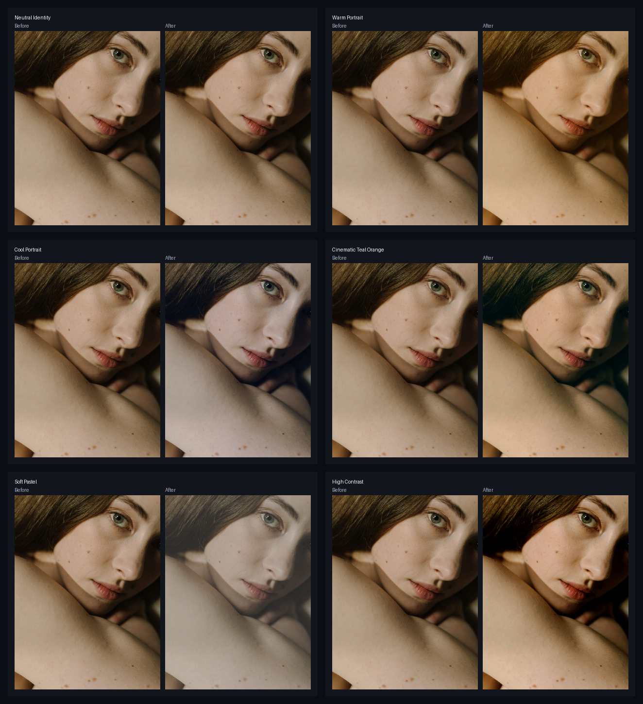

# LUT Preset Gallery

N-34 `JHPixelProLUTPreset` ships six bundled generic Adobe Cube presets. The gallery below was generated from `workflows/sample_portrait.jpg` by invoking the actual N-34 node runtime and saving before/after previews under `docs/assets/examples/lut-preset/`.

## Preset intent

| Preset | Use when |
|---|---|
| `neutral-identity` | You want to verify wiring or compare against a no-op baseline. |
| `warm-portrait` | You want a warmer, softer portrait direction without building a full grade. |
| `cool-portrait` | You want a cleaner cool cast for editorial or product-adjacent portraits. |
| `cinematic-teal-orange` | You want a stronger split-tone look with cooler shadows and warmer skin-adjacent tones. |
| `soft-pastel` | You want lower-contrast, lighter color for gentle beauty or social previews. |
| `high-contrast` | You want punchier separation for quick review images or stronger grading starts. |

## Workflow

Open the [N-34 LUT Preset workflow](https://github.com/jetthuangai/ComfyUI-JH-PixelPro/blob/main/workflows/N-34-lut-preset.json), replace the `LoadImage` placeholder, and switch the `preset` dropdown. Use `intensity` below `1.0` when the full LUT is too strong.

For node details, see [N-34 Preset Pack LUT](../nodes/lut-preset.md).
