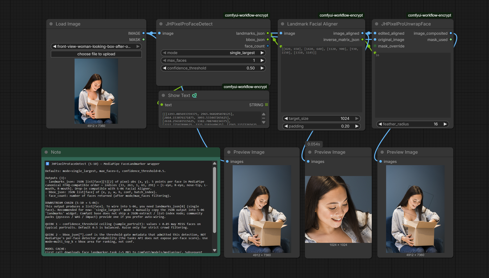

# N-10 Face Detect

`JHPixelProFaceDetect` wraps MediaPipe FaceLandmarker and returns a lightweight 5-point landmark set plus bounding-box metadata. It is the pack's entry node for portrait alignment: the JSON landmarks output can be pasted directly into the N-06 facial aligner workflow, and the bounding-box output is useful for ranking or filtering faces in multi-subject scenes.

## Schema

| Name | Kind | Type / default | Description |
|---|---|---|---|
| `image` | Input | `IMAGE` | Source image for face detection. |
| `mode` | Widget | `COMBO`, default `single_largest` | Returns one largest face or the top-K faces ranked by bounding-box area. |
| `max_faces` | Widget | `INT`, default `1` | Maximum faces to return when `mode = multi_top_k`. |
| `confidence_threshold` | Widget | `FLOAT`, default `0.5` | MediaPipe minimum detection confidence gate. |
| `landmarks_json` | Output | `STRING` | JSON list of 5-point landmarks in `[L-eye, R-eye, nose-tip, L-mouth, R-mouth]` order. |
| `bbox_json` | Output | `STRING` | JSON list of bounding boxes and metadata per detected face. |
| `face_count` | Output | `INT` | Count of faces returned after filtering. |

## Workflow preview

Workflow JSON: [workflows/S-10-face-detect.json](https://github.com/jetthuangai/ComfyUI-JH-PixelPro/blob/main/workflows/S-10-face-detect.json)
