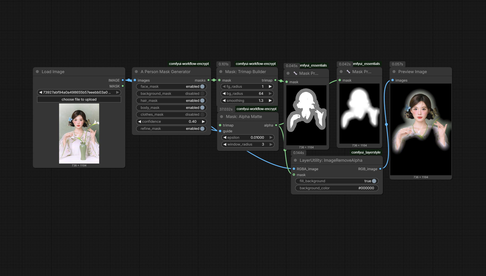

# N-29 Alpha Matte Extractor

`JHPixelProAlphaMatteExtractor` extracts a soft alpha matte from the pack's strict 3-value trimap convention using the Levin 2008 closed-form matting Laplacian. In practice, it is the quality-first mask-finishing node for hair, fur, and semi-transparent edges where binary masks are not good enough. The current pack version adds CUDA acceleration through PyTorch sparse solvers while preserving an exact CPU fallback.

## Schema

| Name | Kind | Type / default | Description |
|---|---|---|---|
| `trimap` | Input | `MASK` | 3-value trimap with `0.0` background, `0.5` unknown, `1.0` foreground and ±0.05 tolerance. |
| `guide` | Input | `IMAGE` | Guide RGB image used to build the local color covariance model. |
| `epsilon` | Widget | `FLOAT`, default `0.0000001` | Numerical regularizer for the local covariance estimate. |
| `window_radius` | Widget | `INT`, default `1` | Local window radius for the Levin matting neighborhood. |
| `lambda_constraint` | Widget | `FLOAT`, default `100.0` | Constraint weight that ties the solve back to known trimap regions. |
| `compute_device` | Widget | `COMBO`, default `auto` | Picks `auto`, `cuda`, or `cpu` for the sparse solve path. |
| `alpha` | Output | `MASK` | Final soft alpha matte for downstream compositing or preview. |

## Workflow preview

Workflow JSON: [workflows/N-29-alpha-matte-extractor.json](https://github.com/jetthuangai/ComfyUI-JH-PixelPro/blob/main/workflows/N-29-alpha-matte-extractor.json)
