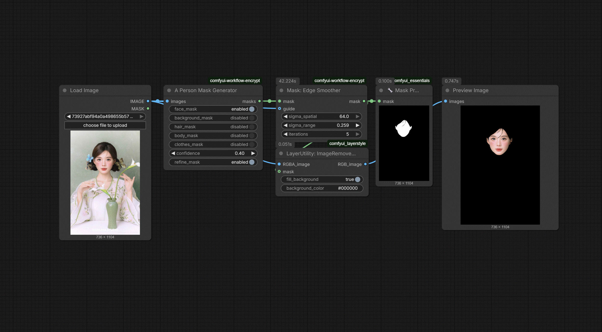

# N-33 Mask Edge Smoother

`JHPixelProMaskEdgeSmoother` cleans up noisy or jagged mask boundaries with bilateral filtering and an optional image guide. It is designed for the last stage of a masking pipeline, after person selection, morphology, or trimap work, when you want a more natural edge transition without rebuilding the mask from scratch.

## Schema

| Name | Kind | Type / default | Description |
|---|---|---|---|
| `mask` | Input | `MASK` | Source mask to smooth. |
| `guide` | Optional input | `IMAGE` | Optional image guide for edge-aware smoothing when subject detail should steer the result. |
| `sigma_spatial` | Widget | `FLOAT`, default `4.0` | Spatial radius of the bilateral smoothing pass. |
| `sigma_range` | Widget | `FLOAT`, default `0.1` | Range-domain smoothing weight on the normalized mask values. |
| `iterations` | Widget | `INT`, default `1` | Number of smoothing passes to run. |
| `mask` | Output | `MASK` | Smoothed mask for downstream blending or compositing. |

## Workflow preview

Workflow JSON: [workflows/N-33-mask-edge-smoother.json](https://github.com/jetthuangai/ComfyUI-JH-PixelPro/blob/main/workflows/N-33-mask-edge-smoother.json)
